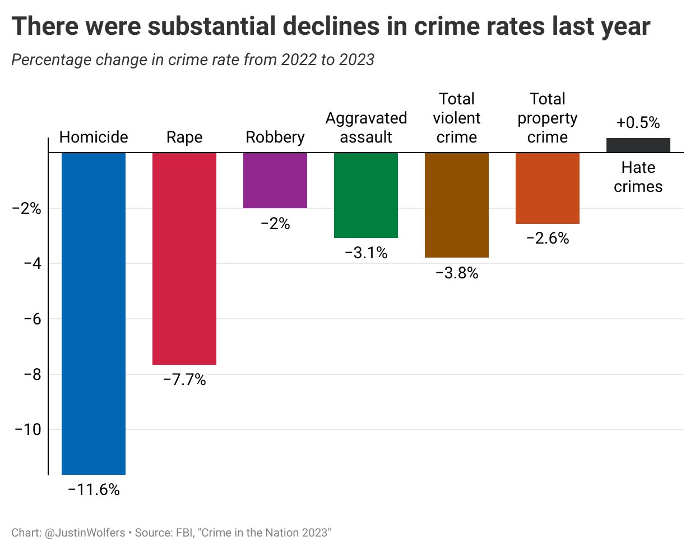
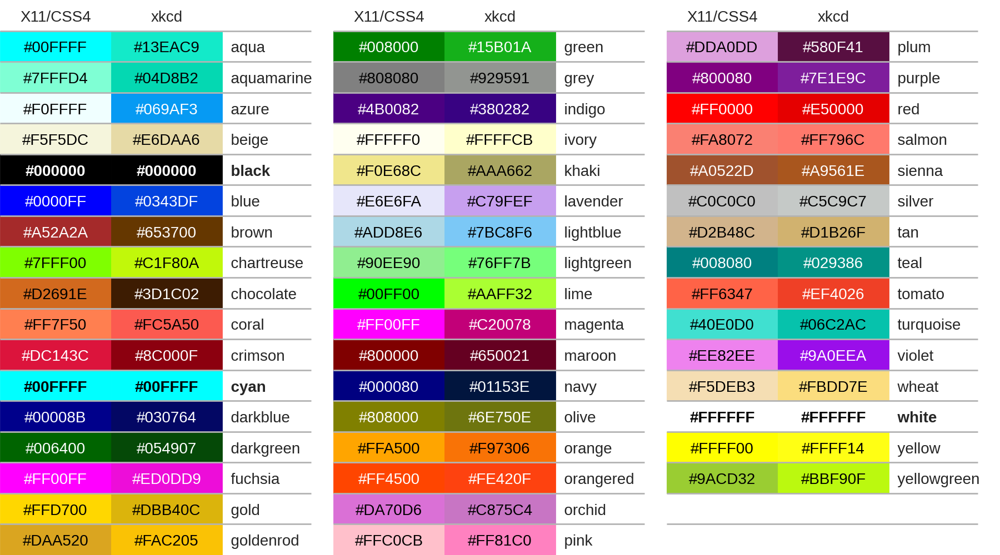

# Week 4: Visualizing Amounts and Bar Graphs

This week, we’ll dive into one of the most fundamental tools in data visualization: **bar graphs**. For a deeper understanding of the concepts covered, you can explore [Chapter 6: Visualizing Amounts](https://clauswilke.com/dataviz/visualizing-amounts.html) by Claus Wilke.

Bar graphs are a versatile tool for comparing numerical values across different categories. Whether you're visualizing simple comparisons, part-to-whole relationships, or complex multi-variable datasets, bar graphs offer a straightforward and effective way to present your data.

## Types of Bar Graphs We’ll Cover:

### 1. Simple Bar Charts
We’ll start with the basics—representing individual amounts across categories. You'll learn why it’s important to start the y-axis at zero, and when a horizontal bar chart might improve readability.

### 2. Grouped Bar Charts
Grouped bar charts allow you to compare multiple related values within a category, like how sales figures compare across different regions over several years. We’ll discuss how to differentiate groups using color or patterns and the role of legends in maintaining clarity.

### 3. Stacked Bar Charts
Stacked bar charts let us see how individual parts contribute to a whole. We’ll explore when to use simple stacked bars versus 100% stacked bars and the types of part-to-whole relationships these charts best represent.

## Key Concepts to Focus On:
- Ensuring clear and consistent axis scales.
- Best practices for selecting colors and using legends.
- Adjusting bar width and spacing for optimal readability.
- Avoiding unnecessary 3D effects, which can obscure data.

By the end of the week, you’ll have a solid grasp of how and when to use different types of bar charts to effectively communicate your data.

---

## Practical Examples of Bar Graphs in Action

Bar graphs are incredibly useful in a variety of fields, including **business, education, research, marketing**, and **finance**, simplifying comparisons and revealing trends hidden within raw data. Below are some real-world examples:

| **Scenario**                        | **Example**                                                                                          | **Usefulness**                                                                                              | **Bar Type**                   |
|-------------------------------------|------------------------------------------------------------------------------------------------------|------------------------------------------------------------------------------------------------------------|---------------------------------|
| **Sales Performance by Product**    | Comparing sales performance of different products in a store.                                         | Instantly see which products perform best and which are underperforming.                                    | Simple Bar Chart               |
| **Survey Results**                  | Visualizing survey results where respondents choose from several options (e.g., favorite programming languages). | Quickly see preference distribution—ideal for reporting survey data.                                       | Simple Bar Chart               |
| **Annual Revenue Comparison**       | Displaying company revenue over the last 5 years.                                                     | Easily visualize revenue trends across years.                                                               | Grouped Bar Chart              |
| **Regional Sales Breakdown**        | Breaking down sales by region and product category.                                                   | See total sales by region and how different product categories contribute.                                  | Stacked Bar Chart              |
| **Employee Distribution**           | Visualizing the number of employees in each department of a company.                                  | Shows department size, useful for HR and resource allocation.                                               | Simple Bar Chart               |
| **Market Share of Companies**       | Comparing market share within an industry.                                                            | Visualizes total market size and relative contributions of each company.                                    | 100% Stacked Bar Chart         |
| **Website Traffic Comparison**      | Comparing the number of visits to different website sections.                                         | Helps identify popular or underperforming sections of the site.                                              | Simple Bar Chart               |
| **Comparing Test Scores**           | Displaying average test scores across different subjects.                                              | Allows teachers to compare class performance at a glance.                                                   | Grouped Bar Chart              |
| **Energy Usage Comparison**         | Showing monthly energy consumption (e.g., electricity or gas).                                        | Clear visual trends in energy usage over time, highlighting high-consumption months.                        | Simple Bar Chart               |
| **Budget Allocation**               | Breaking down budget allocation across departments.                                                   | Reveals the proportion of funds allocated to each department and highlights imbalances.                      | Stacked Bar Chart              |

---

## When Bar Graphs Fall Short

While bar graphs are incredibly useful, there are situations where they may not be the best choice:

### 1. Too Many Categories
   - **Problem**: A cluttered graph with too many categories becomes hard to read. Thin bars or scrolling diminish clarity.
   - **Solution**: Use a **dot plot** or **summary table** for large datasets.

### 2. Visualizing Trends Over Time
   - **Problem**: Bar graphs aren't ideal for continuous data, especially when showing trends over time.
   - **Solution**: Use a **line graph**, which provides a better visual representation of changes over time.

### 3. Comparing Percentages That Don’t Add Up to 100%
   - **Problem**: Bar graphs can give the false impression of showing parts of a whole.
   - **Solution**: Use a **scatter plot** or **dot plot** to avoid misleading comparisons.

### 4. Handling Negative Values
   - **Problem**: Bar graphs struggle to clearly communicate negative values.
   - **Solution**: Use a **line chart** or **waterfall chart** to better illustrate both positive and negative values.

### 5. Showing Data Distribution
   - **Problem**: Bar charts focus on categories or totals, not the spread of data points.
   - **Solution**: Use a **histogram** or **box plot** to visualize distributions effectively.

### 6. Visualizing Continuous Data
   - **Problem**: Bar graphs are meant for discrete categories, not continuous data.
   - **Solution**: Use a **line chart** or **area chart** to capture the flow between data points.

### 7. Precision Matters
   - **Problem**: Bar graphs are imprecise when exact data points are needed.
   - **Solution**: Opt for a **table** or **scatter plot** to show precise comparisons.

---

## Example: Crime Data Visualization by Justin Wolfers

Recently, Justin Wolfers shared crime data on X (formerly Twitter), illustrating significant drops in crime across various categories. A **bar graph**, as shown below, would clearly highlight these reductions, allowing for easy comparison across different crime types.

- **Why it’s effective**: Bar charts allow for quick and easy comparison across categories, helping viewers grasp trends or changes at a glance.

[Link to Tweet](https://x.com/JustinWolfers/status/1838712445524668818)

---

## Anatomy of a Matplotlib Figure

Understanding the basic components of a **Matplotlib** figure is essential for customizing and fine-tuning your visualizations. The diagram below outlines the main parts of a figure, from the canvas to the plot area and axes.

- **Figure (`plt.figure`)**: The entire window or canvas where plots are drawn.
- **Axes**: The area where data is plotted, created automatically with `plt.plot()`.
- **Title (`plt.title`)**: The title of the plot, appearing at the top.
- **Line (`plt.plot`)**: Represents continuous data, like the curves in the diagram.
- **Markers**: Used to highlight individual data points with symbols like `'o'` or `'s'`.
- **Grid**: Adds reference lines for easier reading.
- **Spine**: The borders of the plot, which can be hidden or customized.
- **Ticks and Labels**: Show specific data points along the axes, with **tick labels** showing the values.

Each element of a **Matplotlib** figure can be customized using `pyplot` functions, allowing you to create clear and effective visualizations.

For a deeper dive, check out the [Matplotlib Quick Start Guide](https://matplotlib.org/stable/users/explain/quick_start.html).

---

## Understanding Matplotlib’s Color Guidelines

Colors play a crucial role in creating both aesthetically pleasing and easy-to-understand visualizations. Matplotlib provides various ways to specify colors, offering flexibility for your data visualizations.

Key ways to use color in Matplotlib:
- **Named Colors**: Over 100 predefined colors (e.g., `'red'`, `'blue'`).
- **Hexadecimal Colors**: Commonly used in web design, like `#FF5733` (a bright orange).
- **RGB/RGBA Values**: Custom colors using Red, Green, Blue, or RGBA for transparency.
- **Colormaps**: Ideal for heatmaps, offering gradients such as `'viridis'` or `'plasma'`.

For more on colors, visit the [Matplotlib Color Documentation](https://matplotlib.org/stable/users/explain/colors/colors.html).

----------
Week 4 supplement
1. [Python Lab](Week_4_Python(Fall2024).ipynb)
2. [Week 4 Python Assignment](Week_4_Python_Assignment.md)

